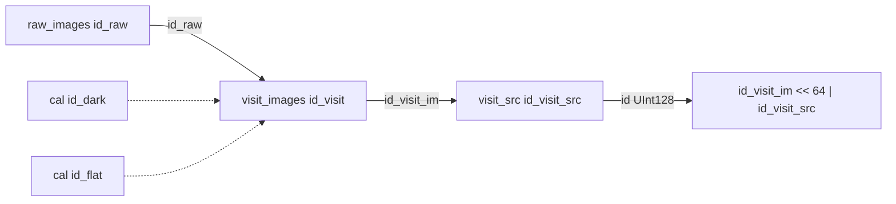

# Pipeline v1 table template

Bottom-line design for `pipeline_template.sql`: **visit pipeline only** (`raw_images` → `visit_images` → `visit_src`). No `proc_*` tables in this template.

## Relationships

- **Image ids** (`id_raw`, `id_visit`): assigned by the pipeline before insert (time-encoded; mount/camera details are pipeline-specific).
- **Source row id**: `id_visit_src` is a per-image running number; global **`id`** is materialized `UInt128` from `(id_visit_im, id_visit_src)`.

## Per-table design

| Table | PARTITION BY | ORDER BY | Indexes / projections |
|-------|----------------|----------|------------------------|
| `raw_images` | `toYYYYMM(dateobs)` | `id_raw` | minmax on `jd` only |
| `visit_images` | `toYYYYMM(dateobs)` | `id_visit` | none in skeleton |
| `visit_src` | `toYYYYMM(dateobs)` | `upix_high` | `prj_image` on `id_visit_im`; `prj_mag_psf` on `mag_psf` |

**`dateobs`**: stored for human-readable time filters and monthly partitions; **`jd`** kept for astronomy. Populate both at ingest.

**`visit_src` ORDER BY `upix_high`**: sky-oriented primary access (same idea as production visit/proc source tables). Image-centric queries use **`prj_image`**, not a wide minmax index grid.

## mag_psf: projection, not minmax

Insert/select benchmarks (`insert_minmax_indexing`) show minmax helps columns **correlated with on-disk order**, not uniform or weakly correlated floats. Magnitudes like **`mag_psf`** behave like random floats relative to `ORDER BY upix_high`, so minmax skip indexes barely prune. **`PROJECTION prj_mag_psf`** (`ORDER BY mag_psf`, `_part_offset` only) is the pattern for magnitude cuts; add more magnitude columns as separate projections only after query proof.

**Single minmax in the template:** `raw_images.jd`, because it tracks the time-encoded `id_raw` sort key.

## Unused columns (current pipeline)

Evidence from sample exports under `pipeline_v0/data/` (same column shapes as visit sources):

### visit_src

| Column | Status |
|--------|--------|
| `id_uniq_src` | Always `0` in samples — not used yet |
| `id_cat_src` | Always `0` in samples — not used yet |

Kept in the skeleton for forward compatibility; omit from indexes until populated.

### visit_images

| Column | Status |
|--------|--------|
| `id_dark`, `id_flat` | Present for calibration lineage; usage not verified from CSV (no visit image export in `pipeline_v0/data`) |

**Coadd note:** one `id_visit` may logically depend on more than one raw exposure; confirm whether `id_raw` is 1:1 or needs a separate link table before locking schema.

## Next steps

1. Extend column lists from `pipeline_v0/sql/visit_images.sql` and `visit_src.sql` as needed.
2. Set `storage_policy` at deploy time.
3. Validate with `EXPLAIN indexes = 1, projections = 1` on representative queries (see `pipeline_v1/IMAGE_SOURCE_JOIN_GUIDELINES.md`).
