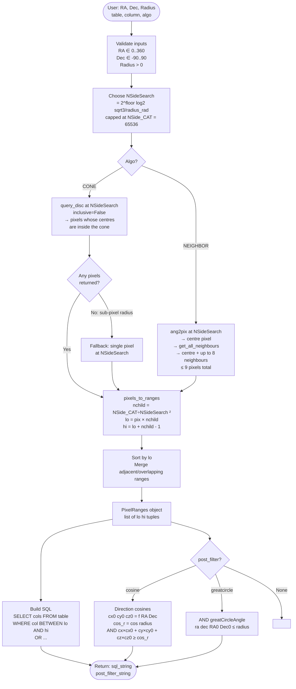
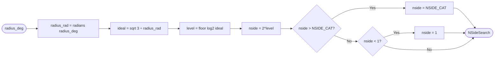
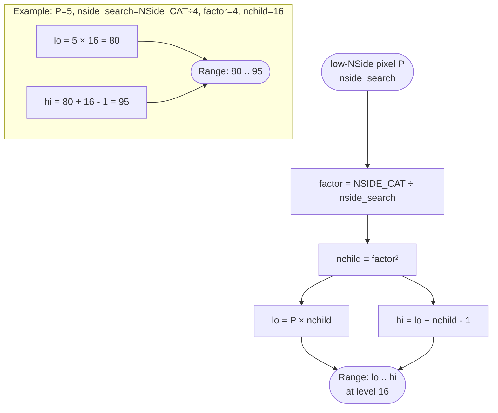
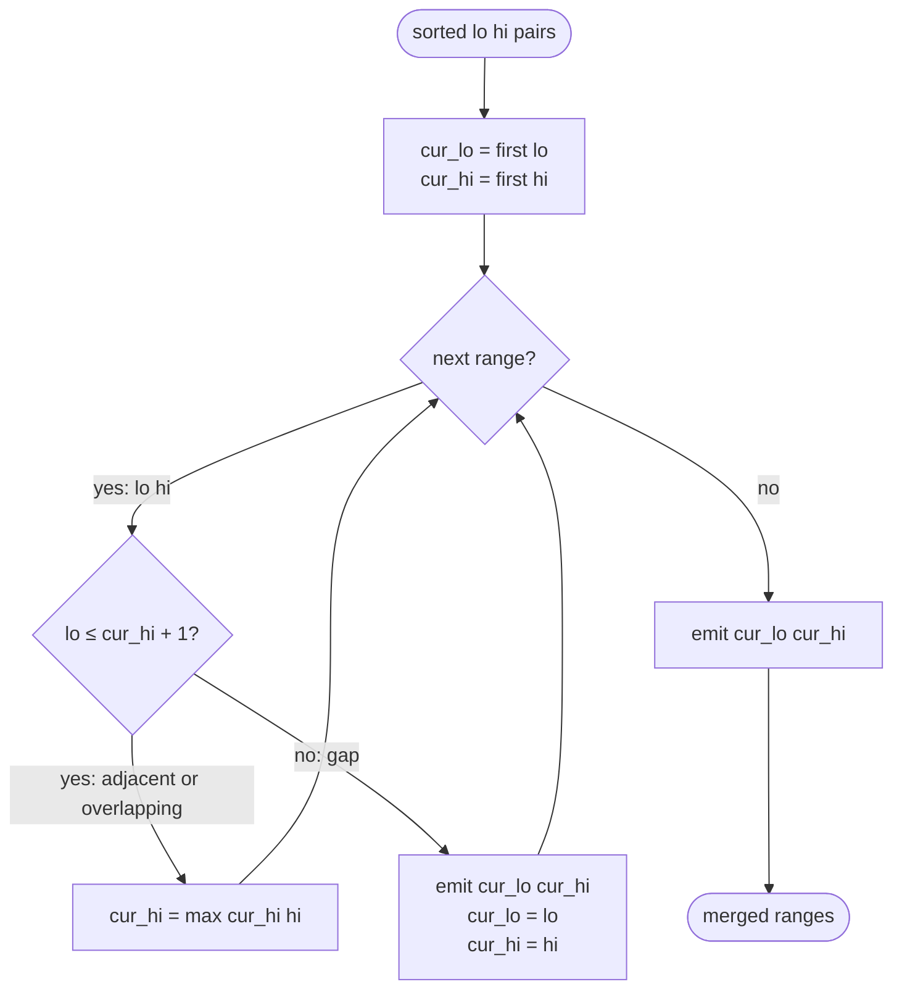
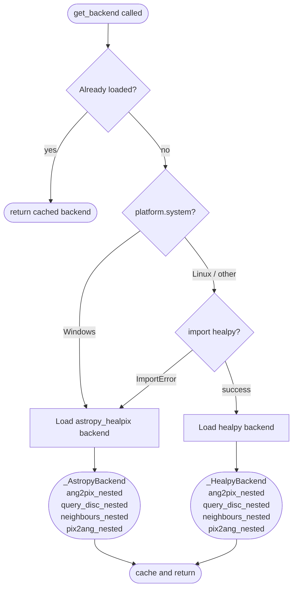
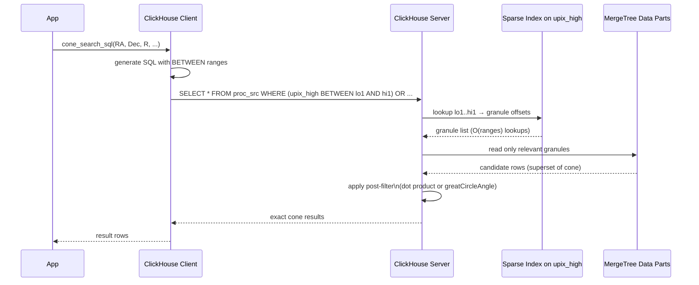
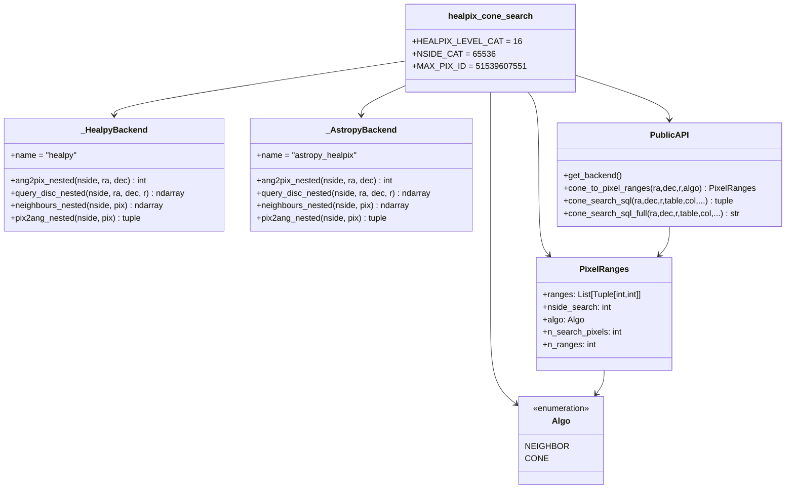

# HEALPix Cone Search — Diagrams

All diagrams use [Mermaid](https://mermaid.js.org/).  
Render with any Mermaid-aware viewer (GitHub, VS Code extension, mermaid.live).

---

## 1. End-to-End Data Flow

---

## 2. NSideSearch Selection

---

## 3. NESTED Pixel Range Expansion

---

## 4. Range Merging

---

## 5. Cross-Platform Backend Selection

---

## 6. NEIGHBOR vs CONE Coverage

---

## 7. ClickHouse Query Execution Path

---

## 8. Module Structure

