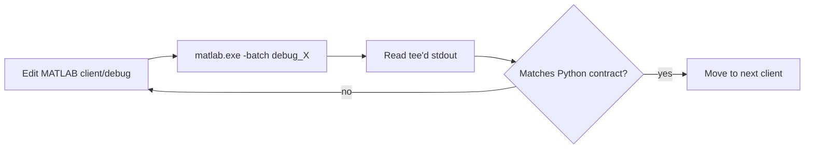

# ULTRASAT — Python API to MATLAB Client Verification Runbook

## Goal

Maintain MATLAB API clients (under `+ultrasat/+api/+clients/`) so each method is a faithful mirror of the Python sync HTTP client of the same name (under `soc/common/clients/`). Verify by running the matching debug script (under `+ultrasat/+api/+debug/+clients/`) headless against the real FastAPI services.

---

## Source of truth

Python is canonical. Never invent a field or rename one in MATLAB.

| Layer                       | Path (Python)                                                           |
| --------------------------- | ----------------------------------------------------------------------- |
| Sync client (HTTP wrapper)  | `c:\Ultrasat\Ultrasat.git\python\prj\nova\soc\common\clients\`          |
| Request/response models     | `c:\Ultrasat\Ultrasat.git\python\prj\nova\soc\common\models\…\api\`     |
| Domain models               | `c:\Ultrasat\Ultrasat.git\python\prj\nova\soc\common\models\…\domain\`  |
| FastAPI service             | `c:\Ultrasat\Ultrasat.git\python\prj\nova\soc\platform\<name>\api.py`   |

| Layer                       | Path (MATLAB)                                                           |
| --------------------------- | ----------------------------------------------------------------------- |
| Client classes              | `matlab\astro\+ultrasat\+api\+clients\`                                 |
| Debug scripts               | `matlab\astro\+ultrasat\+api\+debug\+clients\`                          |
| HTTP base + factory         | `ClientBase.m`, `ClientFactory.m`                                       |

### Endpoint mapping (currently in scope)

| MATLAB method                                        | Python client method                          | Endpoint           | Response model      |
| ---------------------------------------------------- | --------------------------------------------- | ------------------ | ------------------- |
| `NamespaceManagerClient.getNamespaceList`            | `namespace_manager.NamespaceManagerClient.get_namespaces` | POST `/get-namespaces` | `GetNamespacesResponse` (`namespaces: PlatformNamespace[]`) |
| `UserManagerClient.login(user, pass, ns)`            | `user_manager.UserManagerClient.login`        | POST `/login`      | `LoginResponse` (`data: PlatformUser \| null`) |
| `UserManagerClient.logout(user)`                     | `user_manager.UserManagerClient.logout`       | POST `/logout`     | `LogoutResponse` (`status, message`) |

The `Namespace` argument on `login` is kept for `MainModule` interface compatibility — it is **not** sent to the API (Python `LoginParams` has only `username` + `password`).

---

## Environment

Required env vars (already set on Chen's laptop):

| Variable        | Value (this machine)            | Notes                                                         |
| --------------- | ------------------------------- | ------------------------------------------------------------- |
| `SOC_PATH`      | `S:\`                           | Must contain `config\services.json` and `log\` subtree        |
| `SOC_API_KEY`   | `ULTRASOC-2024-10-17`           | Sent in `api-key` header by `ClientBase.postRequest`          |

Verify from PowerShell before running anything:

```powershell
Write-Host "SOC_PATH      = $env:SOC_PATH"
Write-Host "SOC_API_KEY   = $env:SOC_API_KEY"
Get-Content "$env:SOC_PATH\config\services.json" | Select-Object -First 5
```

`services.json` selects the routing mode:

- `mode: "direct"` — calls per-service ports (e.g. `http://127.0.0.1:8101`).
- `mode: "nginx"` — calls `base_api_url + service_path` (e.g. `http://socsrv/api/namespace-manager`).

`ClientFactory.getServiceBaseUrl(name)` honours the `mode` field. Pass an explicit `'direct'` / `'nginx'` second arg to override per-call.

---

## MATLAB launcher

Use the headless `-batch` mode for every iteration. It runs the user's `startup.m` (which adds AstroPack to the path), executes the supplied statement, and exits with a non-zero code on uncaught error. Each run is a clean process — no stale state.

```
C:\Matlab\R2025b\bin\matlab.exe -batch "<MATLAB statement>"
```

Always `Tee-Object` the combined stdout+stderr so you can re-read it without re-running MATLAB:

```powershell
& "C:\Matlab\R2025b\bin\matlab.exe" -batch "<statement>" 2>&1 |
    Tee-Object -FilePath "<run.log>"
```

A normal run prints the AstroPack `startup.m` banner first, then the debug script output. If the path/startup fails you will see `Unrecognized function or variable 'ultrasat...'`.

---

## Sanity check (run once per session)

```powershell
& "C:\Matlab\R2025b\bin\matlab.exe" -batch "ultrasat.api.debug.clients.debug_ClientFactory" 2>&1
```

Expected: `services.json` is found, the API key is loaded, and each in-scope service URL resolves cleanly.

```
ClientFactory sanity check
API key loaded: ULTRASOC-2024-10-17
Service "namespace_manager" URL resolved: http://socsrv/api/namespace-manager
Service "user_manager"      URL resolved: http://socsrv/api/user-manager
...
```

---

## In-scope debug scripts

### Namespace Manager — list namespaces

```powershell
& "C:\Matlab\R2025b\bin\matlab.exe" -batch "ultrasat.api.debug.clients.debug_NamespaceManagerClient" 2>&1
```

Expected response shape (matches `GetNamespacesResponse` and `PlatformNamespace`):

```
status      : 'ok'
message     : []
namespaces  : <Nx1 struct> with fields:
              namespace, display_name, description, is_active, created_time, updated_time
display_list: {'<namespace>:<display_name>', ...}
```

Failure modes to look for:

- `status: 'error'` and a non-empty `message` → server-side problem; read the FastAPI log.
- Missing field on a namespace entry → Python model changed; update `PlatformNamespace` in MATLAB code paths only if the MATLAB code actually consumes that field.
- Empty `namespaces` → DB is empty or filter mis-applied.

### User Manager — login / logout / wrong password

```powershell
& "C:\Matlab\R2025b\bin\matlab.exe" -batch "ultrasat.api.debug.clients.debug_UserManagerClient" 2>&1
```

Expected output (three calls, in order):

1. Login `chen` / `123` / `OPER` → `status='ok'`, `ok=1`, `data` = `PlatformUser` struct with fields `username, display_name, role, namespaces, email, phone, is_active`.
2. Logout `chen` → `status='ok'`, `ok=1` (server is stateless — always returns ok).
3. Login `chen` / `wrong` → `status='error'`, `message='Invalid username or password'`, `data=[]`, `ok=0`.

Failure modes:

- `Unrecognized function or variable 'ApiKey'` in the constructor → revert/redo the constructor fix (see "Common pitfalls" below).
- `HTTP error: 401/403` → `SOC_API_KEY` mismatch with what the FastAPI service expects.
- `Connection failed` → wrong `mode` in `services.json`, or the Python service / nginx is down.

---

## Iteration loop



1. Read the Python client + response model first; write down the exact field names and types.
2. Open the MATLAB client and confirm each method sends only those fields and reads only those fields.
3. Run the matching debug script with `-batch`.
4. If the printed struct doesn't match, edit the MATLAB client (never the Python side from here).
5. Re-run until clean.

---

## Forbidden

- No guessing API field names or types — Python is authoritative.
- No GUI changes from this loop.
- No `error()` thrown from a client method — return `struct('status','error','message',...)` instead (`ClientBase.postRequest` already does this).
- Do not add MATLAB methods that have no MATLAB caller yet. The MATLAB side can lag the Python side; only port methods on demand.
- Do not create new debug files unless explicitly asked. Edit the existing one to print more detail.
- Never touch anything under `+clients\obsolete\` or `+debug\+clients\obsolete\`.

---

## Common pitfalls

- **Constructor argument lists must match the body.** A constructor declared `function obj = XClient(BaseUrl)` cannot reference an `ApiKey` variable in its body — that reads as an undefined identifier and crashes before any HTTP call. Let `ClientBase` pull `SOC_API_KEY` from the environment (it does so when the property is empty).
- **`-batch` requires the AstroPack path to be set by `startup.m`.** If you launch with `-nodisplay -nojvm` or strip `startup.m`, you must `addpath(genpath('C:\Ultrasat\AstroPack\matlab'))` yourself.
- **`jsondecode` collapses single-element JSON arrays into a scalar struct.** When the server returns one namespace/user, MATLAB sees a 1x1 struct, not a 1x1 struct array. Code that does `{entries.field}` still works for both cases.
- **Datetimes arrive as ISO strings.** `JsonUtils.json2struct` already runs them through `DateTimeUtils.convertStringToDatetime`, so they print as MATLAB `datetime` objects in tables.
