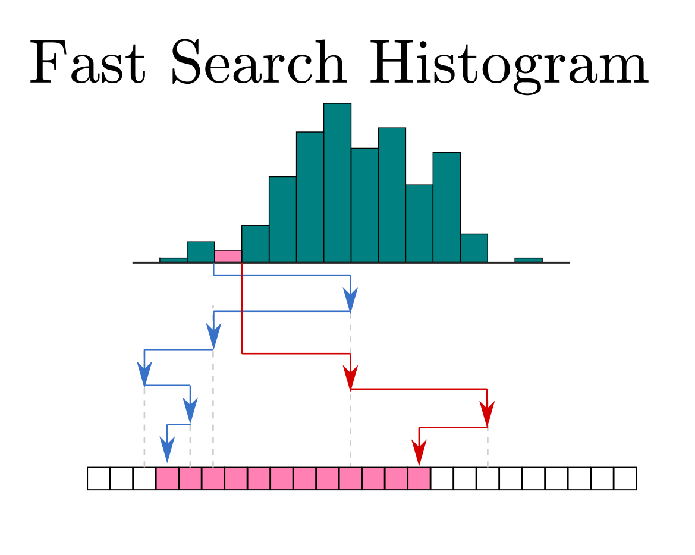

#  
**Bryce M. Henson**  
Fast 1d histograming algorithms based on binary search.   
**Status:** This Code **is ready for use in other projects**. Testing is implemented and passing.

[](https://www.mathworks.com/matlabcentral/fileexchange/71526-fast_search_histogram)
[](https://img.shields.io/static/v1.svg?label=CSL&message=software%20against%20climate%20change&color=green?style=flat&logo=github)

This project demonstrates superior speed to Matlab's inbuilt histcounts function and provides an adaptive function (hist_adaptive_method) that automatically picks the fastest method.

The brute approach to histograming is to compare each bin to each data value (or *count*) and gives a complexity **O(n·m)** where *n* is the number of data values and *m* is the number of bins. This can be improved by two algorithms.
1. **Bin Search, O(n·log(m))**: For each count do a binary search for the histogram bin that it should go into and then increment that bin. Because the bins are already ordered then there is no sorting needed. Best when m>>n (sparse histograming).
2. **Count Search, O(m·log(n))**:  For each bin edge do a binary search to find the nearest data index. Use the difference in this data index between bins to give the number of counts.  Must have ordered data for the search to work, sorting first would cost **O(n·log(n))** and would make this method always slower. Best when n>>m (dense histograming) which is the more common use use case. (this is the mehod shown in the logo)

I obsereve empirically (see fig. 1 & hist_scaling_test) that there is a fiairly complex dependence of which algorithm is best on the value of n and m. I have implemented a function hist_adaptive_method that does a good job of picking the fastest method.


## Usage
The normal way of taking a histogram in matlab is using histcounts. The functions developed here also return a lower and upper bin which contains the counts that were below(above) the first(last) edge so to be fair we add in ±inf to the edges.
```
data=rand(1e5,1);
edges=linspace(0.1,1.1,1e6)';
data=sort(data);
out_inbuilt=histcounts(data,[-inf;edges;inf])';
```
The simplest use case is just to call the adaptive hist method which uses heuristics to come up with a decent guess of wich method is best.
```
out_adaptive=adaptive_hist_method(data,edges);
isequal(out1,out2)
```
If your use case is pretty restricted in the domain of n(number of data values),m(number of bins) then you can use hist_compare_methods to find out the speeds of each method and then just use the fastest one. 
```
[best_meth_str,details]=out_adaptive=adaptive_hist_method(data,edges);
best_meth_str
details.core_times
```
The underlying count_search and bin_search functions can be called by themseleves if you know the number of bins and counts. For the case when m(number of bins) is much greater than n(number of data values) use hist_bin_search.
```
bin_counts=hist_bin_search(data,edges)
```
The first(and last) bin_count is the number of counts below(above) the first(last) edge.
For **sorted counts** where n(number of data values) is much greater than m(number of bins) use hist_count_search.
```
bin_counts=hist_count_search(data,edges)
```


## Benchmarking
|  | 
|:--:| 
 **Figure 1**- Comparison of the search based methods to matlabs inbuilt histogram i7-3610 @ 3.00GHz. The reader should note the inverted Z axis with. Data is sampled from the uniform unit distributon, bins are uniform across the unit interval. The search based algorithms outperform for most combinations of n and m exept for a band ~(m<n & m>1e5) where the inbuilt isup to 5x faster than the search based methods. The more comon use cases are the left side of the plot where m<n. The adaptive method uses heuristics to choose  the best method.|

## Features
count_search_hist  
- sparse opt: will not run the count search if the higest edge of the current bin is less than next count (after the last bin)
  - may slow dense case down by one compare evaluation
  
## Also See
[https://github.com/brycehenson/fast_sorted_mask](https://github.com/brycehenson/fast_sorted_mask) where I apply similar principles to dramaticaly speed up masking operations (in certian cases). 	

## Future work
contributors welcome! Drop me an [email](mailto:bryce.m.henson+github.fast_search_histogram@gmail.com?subject=I%20would%20Like%20to%20Contribute[github][fast_search_histogram]) .

- [x] logo
- [x] clean main branch
- [x] clean up hist_scaling_test
- Investigate what the effect of non uniform underlying density has on the relative performance
- improve hist_adaptive_method
  - try and use some kind of learner or clasifier to predict the best method to use baed on some model and n,m
  - had good sucess with a gaussian kernel SVM: ~87% accuracy, 7ms prediction runtime
  - predition runtime is still prohibitive for an adaptive wraper
  - perhaps a hybrid approach where a more simple rule is used for the small n,m then when the margins or the optimal/suboptimal algorithm are larger than the perdiction time the SVM model is used. 
- try forward prediction for count search.
  - based on the count in the previous bin estimate a better place to start the binary search.
  - improvements of log(n)/log(2*n/m) , ~2.6 for n=1e6 m=1e4
  - worst case log(n)+1
  - works best for dense histogram
 
- try basic search reduction in Bin Search
  - compare count with last value to search only edges above or below that.
  - NO improvement for counts in the middle log2(n)/(log2(n/2)+1) =~1 
  - for uniform dist aprox 5% speedup for 1e6 see /dev/opt_for_bin_Search.m
  - can be generalized to a pre search look up table
    - see [Interpolation search](https://en.wikipedia.org/wiki/Interpolation_search)
	- tradeoff between look up table depth/overhead and increased performance 
    - randomization may improve performance	
- add to fileexchange

## Contributions
- **Benjamin Bernard** Binary search modified from fileexchange project [binary-search-for-closest-value-in-an-array](https://au.mathworks.com/matlabcentral/fileexchange/37915-binary-search-for-closest-value-in-an-array)
- **Daniel Eaton**    [sfigure](https://au.mathworks.com/matlabcentral/fileexchange/8919-smart-silent-figure)


