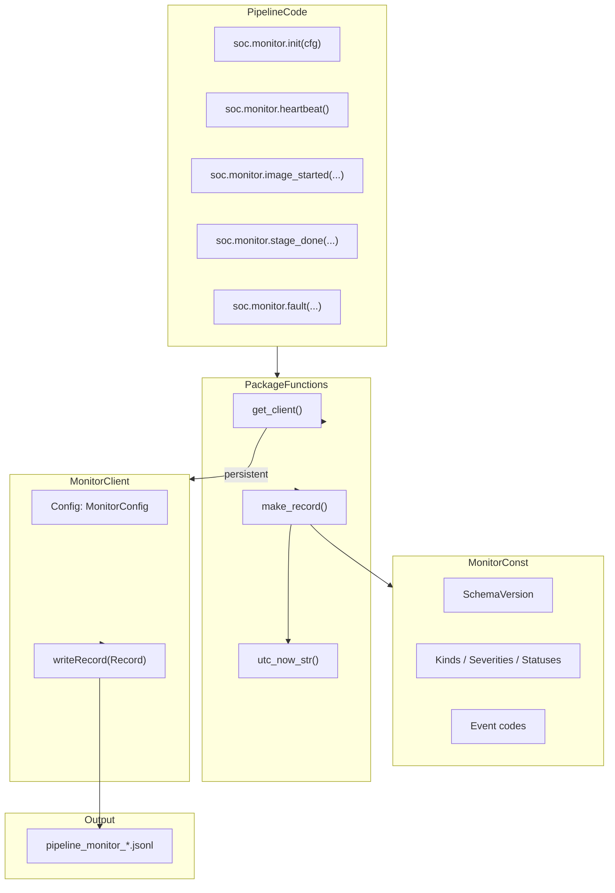
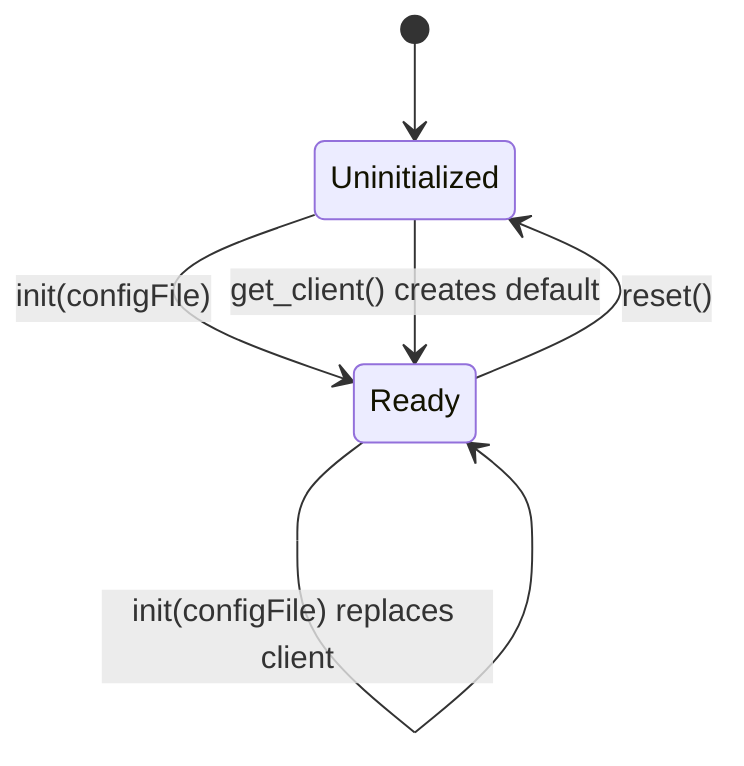

# soc.monitor — Package Architecture

## Overview

The `soc.monitor` package provides a thin function API for pipeline developers. Internally, a singleton `MonitorClient` writes JSON lines to daily JSONL files.

## Component diagram



## File layout

```text
matlab/util/+soc/+monitor/
├── MonitorConst.m
├── MonitorConfig.m
├── MonitorClient.m
├── init.m / get_client.m / reset.m
├── make_record.m / utc_now_str.m
├── heartbeat.m, image_*.m, stage_*.m, ...
├── +debug/
│   ├── debug_monitor.m
│   └── debug_schema.m
└── docs/
    ├── README.md
    └── diagrams/
```

## Singleton lifecycle


