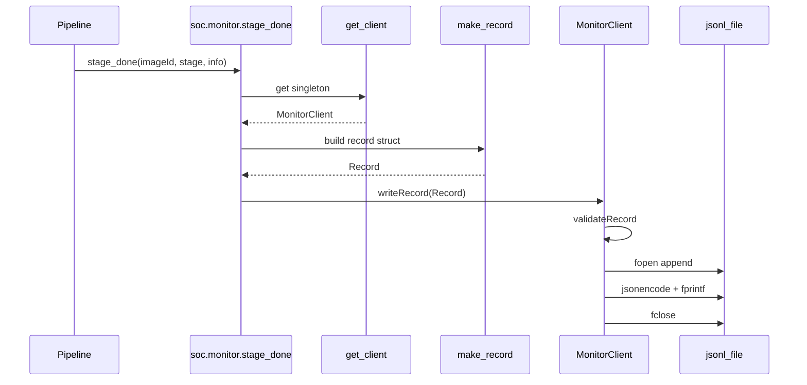
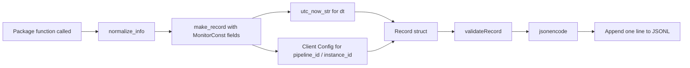
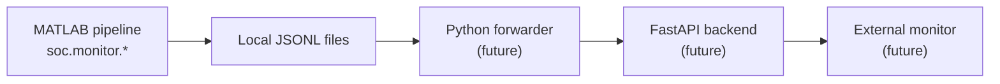

# soc.monitor — Record Write Flow

## Sequence: one monitoring call

## Record build steps

## End-to-end data path (future)

MATLAB writes JSONL locally. Downstream Python forwarder and backend are separate tasks (specs 04–06).

